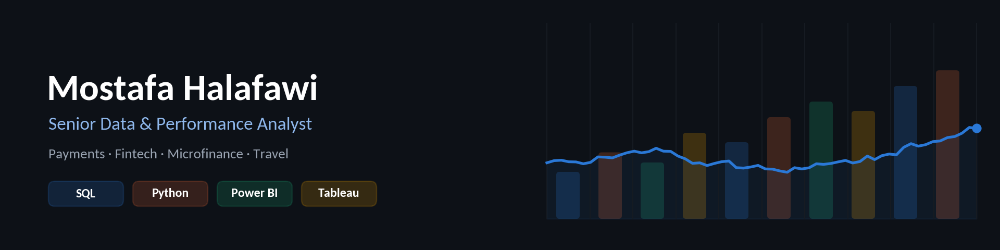
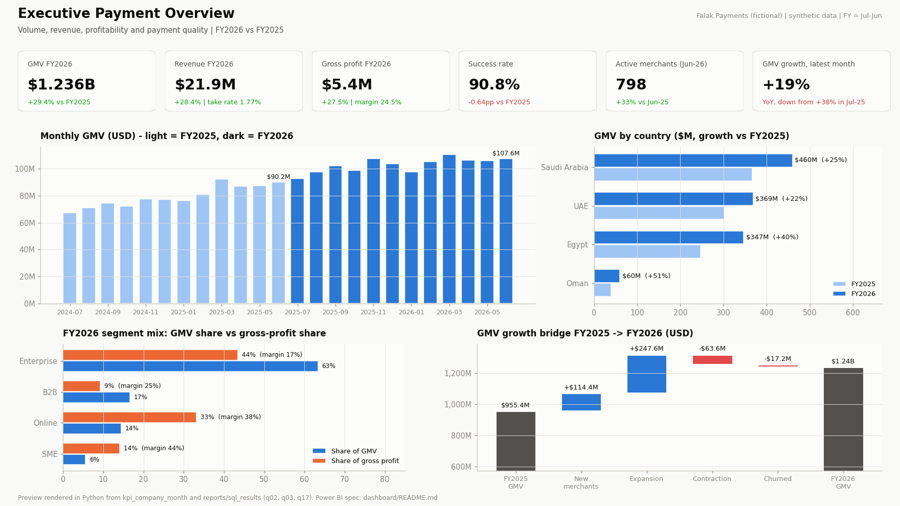
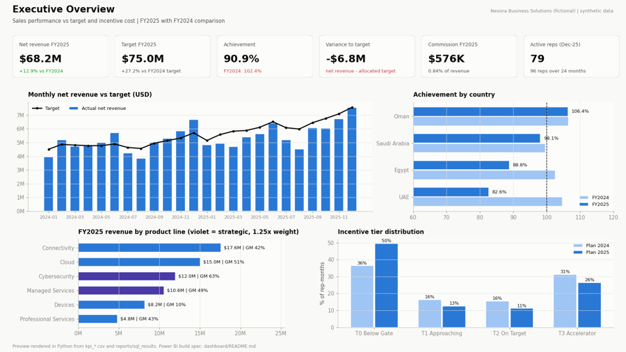
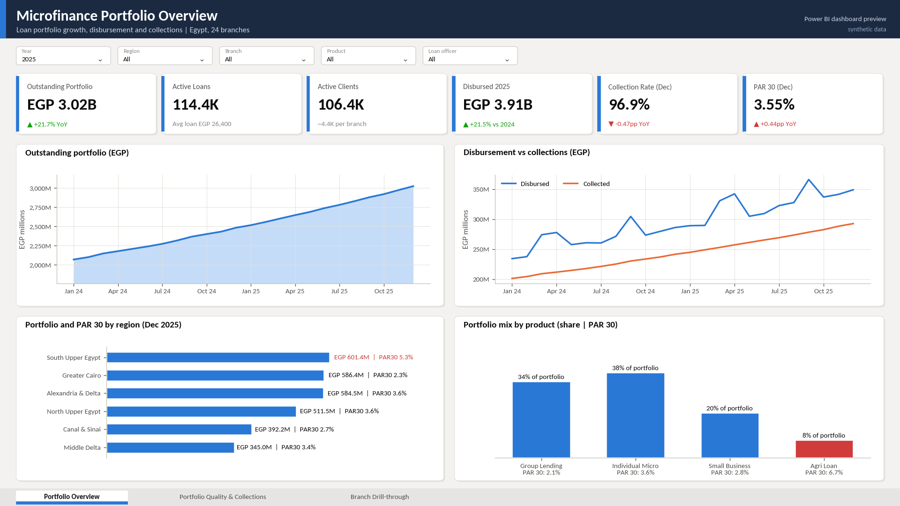
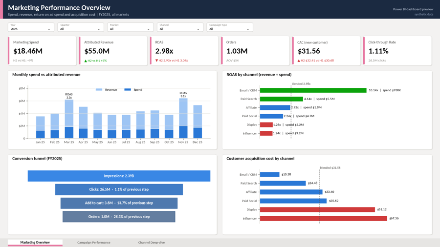
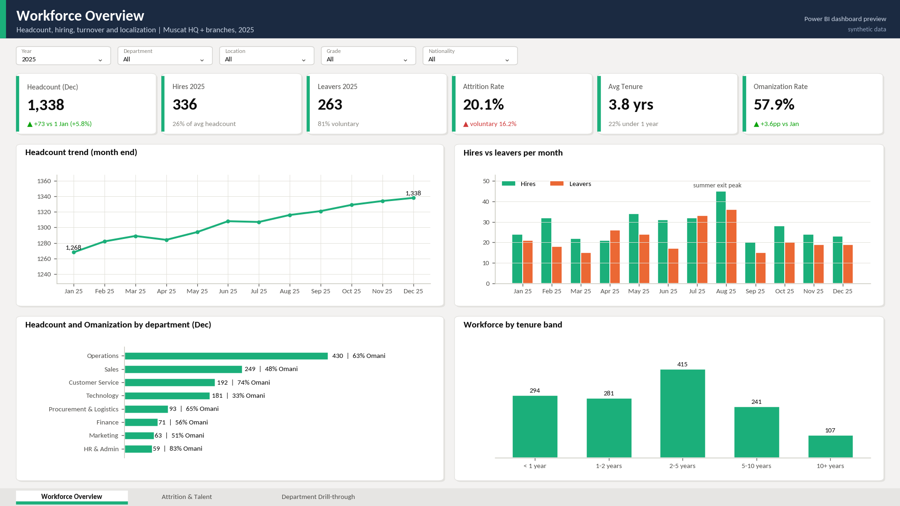
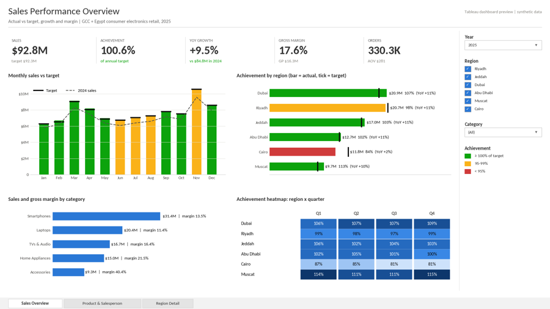
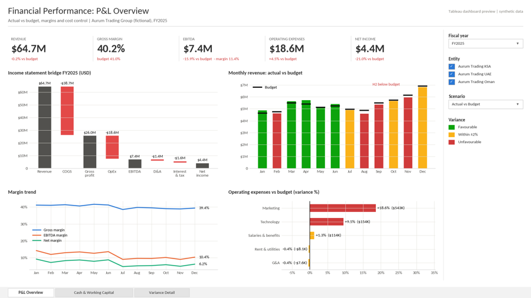
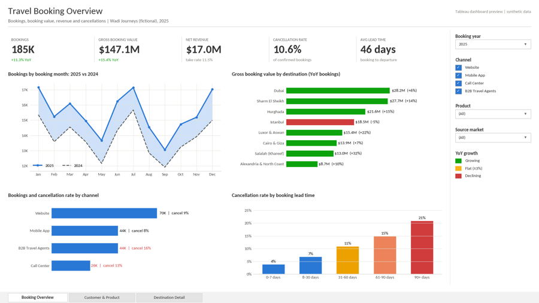

### Hi, I'm Mostafa 👋

I'm a **Senior Data & Performance Analyst** with experience in **payments, digital microfinance, travel and banking**.
I build the KPIs, dashboards and analysis that management uses to make decisions: merchant and sales performance,
incentive and commission design, portfolio quality, and root-cause analysis.

- 💳 **Now:** Senior Performance & Payments Analyst in B2B payments
- 🧭 **Before:** Travista (Senior Business & Data Analyst) · Fawry Microfinance · National Bank of Egypt
- 🌍 **Location:** Cairo, Egypt. Open to roles in **Muscat, Oman** and across the **GCC**.

---

### 🛠️ Toolkit

**What I'm good at:** KPI frameworks · star-schema data models · data-quality checks · variance and root-cause analysis ·
commission and incentive design · cohort and portfolio analysis · executive reporting

---

### ⭐ Featured: end-to-end analytics projects

<table>
<tr>
<td width="50%" valign="top">

<b><a href="https://github.com/mostafahalafawi/payment-merchant-performance-analytics">Payment & Merchant Performance Analytics</a></b> 
~2M rows of payment data → ETL with data-quality rules, star schema, SQL KPIs, merchant health scoring, gateway incident detection and billing leakage checks. <b>Python · SQL · Power BI</b>
</td>
<td width="50%" valign="top">

<b><a href="https://github.com/mostafahalafawi/sales-performance-commission-analytics">Sales Performance & Commission Analytics</a></b> 
CRM/ERP data → validated star schema, SQL KPI layer, versioned commission engine, variance decomposition and an executive dashboard. <b>Python · SQL · Power BI</b>
</td>
</tr>
</table>

### 📊 Power BI dashboards

<table>
<tr>
<td width="33%" valign="top">

<b><a href="https://github.com/mostafahalafawi/microfinance-loan-portfolio-dashboard">Microfinance Loan Portfolio</a></b> 
Portfolio at risk (PAR), collections, branch and loan-officer risk
</td>
<td width="33%" valign="top">

<b><a href="https://github.com/mostafahalafawi/marketing-campaign-performance-dashboard">Marketing Campaign Performance</a></b> 
Spend, ROAS, CAC and channel funnel
</td>
<td width="33%" valign="top">

<b><a href="https://github.com/mostafahalafawi/hr-workforce-analytics-dashboard">HR Workforce Analytics</a></b> 
Headcount, attrition, engagement and Omanization
</td>
</tr>
</table>

### 📈 Tableau dashboards

<table>
<tr>
<td width="33%" valign="top">

<b><a href="https://github.com/mostafahalafawi/sales-performance-kpi-dashboard">Sales Performance KPIs</a></b> 
Target achievement, YoY growth, margin and salesperson ranking
</td>
<td width="33%" valign="top">

<b><a href="https://github.com/mostafahalafawi/financial-performance-dashboard">Financial Performance</a></b> 
P&L vs budget, EBITDA, cash flow and working capital
</td>
<td width="33%" valign="top">

<b><a href="https://github.com/mostafahalafawi/travel-booking-analytics-dashboard">Travel Booking Analytics</a></b> 
Bookings, GBV, take rate, cancellations and destinations
</td>
</tr>
</table>

All projects are portfolio work built on <b>synthetic data</b> for fictional companies. No employer or customer data is used.

---

📫 **Let's talk:** I'm open to Senior Data Analyst, Performance Analyst, BI and Payments Analytics roles. The fastest way to reach me is [LinkedIn](https://www.linkedin.com/in/mostafa-halafawi).
